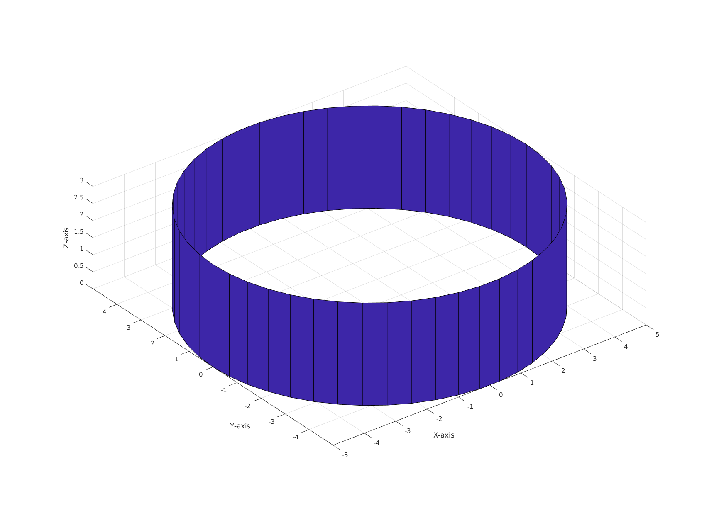

# microMonteCarlo


A micro project for playing around with Monte Carlo simulations. 
This project was initially for simulating Electron Transport using Monte Carlo methods.
For more information on Monte Carlo methods for electron transport see here:
https://en.wikipedia.org/wiki/Monte_Carlo_methods_for_electron_transport

### Installation
This project is built and validated in **MATLAB R2022a** running on **Ubuntu 22.04.03** and **MacOS 14 Sonoma**. 
However it should work in any MATLAB version and in Windows.

In Ubuntu or MacOS open a terminal and clone the repo, then open the project in MATLAB.
To clone the project enter this in a terminal:
```bash
git clone https://github.com/JonathanALevine/microMonteCarlo
```

### Example usage
To set up a simulation with random scattering disabled set `scattering = 0` in `config.m`.
`config.m` contains other variables that control the conditions of the simulation. 
`num_particles` sets the number of particles and `distribution_type` sets the initial distribution of the
particle velocities. The example MATLAB code below sets `distribution_type = 'MB'` for a Maxwell-Boltzmann distribution.

```matlab
% Constants
global m0 m T k tau Pscat dt epochs;
global num_particles distribution_type scattering;
global vth;
global world;
global dt;


m0 = 9.10938356*10^(-31); %Electron rest mass
m = 0.26*m0;
T = 300; % temperature in kelvin
k = 1.38064852*10^(-23); %Boltzmann Constant
tau = 0.2*10^(-12);
world.length = 400*10^(-9);
world.height = 200*10^(-9);
vth = sqrt(2*k*T/m);
dt = world.height/vth/100;
epochs = 250;
Pscat = 1 - exp(-dt/tau);
% Simulation controls
num_particles = 250;
distribution_type = 'MB';
scattering = 0;
```

World boundary conditions are controlled by `WorldBoundaryHandler.m`.
with `specular_boundaries = 1` the borders of the world are rigid causing particles to bounce off the borders.
With `specular_boundaries = 0` the horizontal borders are rigid but the vertical borders wrap around, 
so the world has is basically a cylinder like this:


`main.m` runs the simulation and an example is below:
```matlab
close all;  
clear; %intialization
set(0,'DefaultFigureWindowStyle','docked')
config; % load the simulation configurations
states = GenerateStates(num_particles, distribution_type);
run(states, epochs);
```


### Features
List down the features of your project here. For example:
- Electron movement under an electric field is implemented in `Part5.m` in 
[legacy](https://github.com/JonathanALevine/microMonteCarlo/tree/legacy).
Work is ongoing at tranferring this to [main](https://github.com/JonathanALevine/microMonteCarlo). 
PR's are welcome if you would like to implement this. 
- This project currently does not have tests. This is needed. PR's are welcome if you would like to implement this.
- For code to record the simulation to record the simulations as a video see `main.m` and `run.m` in [readme-file](https://github.com/JonathanALevine/microMonteCarlo/tree/readme-file). 
See https://itsfoss.com/convert-video-gif-linux/ on how to convert .avi files to gif via Linux terminal commands.
